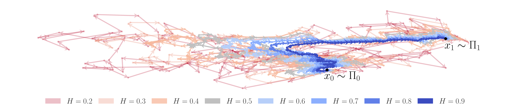

<h1 align="center">Fractional Diffusion Bridge Models <br> (NeurIPS 2025) </h1> 

This repository contains the official [PyTorch](https://pytorch.org/) implementation of [Fractional Diffusion Bridge Models](https://arxiv.org/abs/2310.17638) (FDBM) for paired data translation, a generative diffusion bridge model driven by fractional noise. 

### Introduction

The path between two states of nature is neither deterministic nor arbitrary, but follows a probabilistic law constrained by boundary conditions. Diffusion bridges solve these boundary value problems by modeling stochastic trajectories that connect specified source and target distributions. We generalize these interpolating trajectories from a driving Brownian motion to an approximation of non-Markovian fractional Brownian motion (fBM), capturing long-term memory, roughness, and anomalous diffusion missing in standard Brownian motion. These properties are controlled by the Hurst index $H\in(0,1)$:



The official FDBM implementation for unpaired data translation is available [here](https://github.com/mspringe/FDBM_unpaired). Our stand-alone reimplementation of [SBFlow](https://arxiv.org/abs/2409.09347) can be found [here](https://github.com/mspringe/Schroedinger-Bridge-Flow). 

## Dependencies

To run this code, install the latest project conda environment stored in `fdbm.yml` via 

```python
conda env create -f fdbm.yml
```

## Conformational Changes in Proteins

We train FDBM to predict conformational changes in proteins using the curated subset of the D3PM dataset from [Aligned Diffusion Schrödinger Bridges](https://arxiv.org/abs/2302.11419). 

### Dataset
The raw and processed D3PM datasets are available on [zenodo](https://zenodo.org/records/8066711), as provided by the authors of [SBALIGN](https://github.com/IBM/aligned_diffusion_bridges). Following the setup instructions in the SBALIGN repository, you should obtain two directories: `fdbm/data/processed` and `fdbm/data/raw`.

### Training 

To train FDBM for predicting conformational changes in proteins, choose a Hurst index $H\in (0,1)$ and run

```python
python scripts/conf/train.py --method fdbm --H H --config config/conf_train.yml
```
If you want to adjust the number of augmenting processes to $K\in\mathbb{K}$, simply add '--K K'. Note, however, that values $K>5$ only marginally improve the approximation quality, and $K>10$ will not be numerically stable. 
To train the purely Brownian dynamics proposed in [Augmented Bridge Matching](https://arxiv.org/abs/2311.06978) (ABM)  or in [Aligned Diffusion Schrödinger Bridges](https://arxiv.org/abs/2302.11419) (SBALIGN), use `--method abm` or `--method sbalign`, respectively. 

### Evaluation of Trained Models

To evaluate a trained model saved in `logs/checkpoint_folder`, run:

```python
python scripts/conf/evaluate.py --run_name checkpoint_folder --H H --K K --g 0.2
```

where $H\in(0,1)$, $K\in\mathbb{N}$ and $g>0$ should be chosen according to the training configuration.

We provide the best-performing FDBM model with $K=5$ and $H=0.2$ in `logs/CONF_TP_MODEL-5211-K-6-H-0.2-norm-True-g-0.2`, as well as the best performaing ABM baseline model in `logs/CONF_TP_MODEL-5172-K-0-H-0.5-norm-True-g-0.2`.

To evaluate $\text{FDBM}(H=0.2)$ run:

```python
python scripts/conf/evaluate.py --run_name CONF_TP_MODEL-5819-K-5-H-0.2-norm-True-g-0.2
```
To evaluate ABM run: 

```python
python scripts/conf/evaluate.py --run_name CONF_TP_MODEL-5175-K-0-H-0.5-norm-True-g-0.2
```

These models achieve the following scores, averaged over ten sampling runs:

|**D3PM Test Set**|**RMSD(Å) Median**↓|**RMSD(Å) Mean**↓|**RMSD(Å) Std**| **%RMSD(Å) < 2**↑|**%RMSD(Å) < 5**↑| **%RMSD(Å) < 10**↑|
|------------------------------|--------------------:|------------------:| -----------------:|-----------------:|-----------------:|------------------: |
|ABM |2.05|3.33|3.65|48%|85%|97 %|
|FDBM(H=0.2)|**1.95**|**3.27**|3.60|**51%**|**87%**|97%|

In the paper, we averaged results over five independent training runs, whereas here we report the scores averaged over ten sampling runs for the best-performing FDBM with $H=0.2$ and the best-performing ABM baseline provided in `logs`. 

## Experiments on Toy Data

To showcase that ABM and FDBM are training-data–coupling-preserving, see `toy/coupling_preserving.ipynb`. For a visual comparison of ABM and FDBM on two-dimensional toy datasets, see `toy/vis_toy_abm.ipynb` and `toy/vis_toy_fdbm.ipynb`. To quantitatively compare the performance of ABM and FDBM on the two-dimensional toy datasets (`moon` or `tshaped`), run:

```python
python toy/quant_toy.py --dataset moon --runs 10
```

The mean Wasserstein distance and the corresponding standard deviation over these $10$ runs will be stored in separate `.csv` files in `toy/reproducibility/moon`. The performance of ABM appears in the first row under the column $H=0.5$, and the performance of FDBM for different Hurst indices appears in the second row.


## Bibtex Citation

We kindly ask that you cite our paper when using this code:
    
    @inproceedings{
        nobis2025fractional,
        title={Fractional Diffusion Bridge Models},
        author={Gabriel Nobis and Maximilian Springenberg and Arina Belova and Rembert Daems and Christoph Knochenhauer and Manfred Opper and Tolga Birdal and Wojciech Samek},
        booktitle={The Thirty-ninth Annual Conference on Neural Information Processing Systems},
        year={2025},
        url={https://openreview.net/forum?id=Hhc5McwASX}
    }

Since the paired-setting implementation of FDBM builds upon the official [SBALIGN](https://github.com/IBM/aligned_diffusion_bridges) codebase, please also cite [Aligned Diffusion Schrödinger Bridges](https://arxiv.org/abs/2302.11419) when using this repository:

    @inproceedings{
        somnath2023aligned,
        title={Aligned Diffusion Schr\"odinger Bridges},
        author={Vignesh Ram Somnath and Matteo Pariset and Ya-Ping Hsieh and Maria Rodriguez Martinez and Andreas Krause and Charlotte Bunne},
        booktitle={The 39th Conference on Uncertainty in Artificial Intelligence},
        year={2023},
        url={https://openreview.net/forum?id=BkWFJN7_bQ}
    }
